## Overview

The following Jumpstart Drop will guide you through using the multicloud connector enabled by Azure Arc.  It will show how to onboard EC2 instances from Amazon Web Services (AWS) as well as view an inventory of AWS resources within Azure.

## Prerequisites

Note that to complete this Drop, you will need permissions both in AWS as well as in Azure.  

### AWS Prerequisites

In AWS, you'll need the following permissions:
- AmazonS3FullAccess
- AWSCloudFormationFullAccess
- IAMFullAccess
- Global Read (for the Inventory solution)
- AmazonEC2FullAccess (for the Arc Onboarding solution)
- EC2 Write (for the Arc Onboarding solution)

For the Arc Onboarding solution, the EC2 instances must also:
- satisfy the [prerequisites for the Connected Machine agent](https://learn.microsoft.com/en-us/azure/azure-arc/servers/prerequisites).
- have the SSM agent installed
- be tagged with a key of *arc* and any value.  Without this tag, the EC2 instances will not be onboarded.
- have the ArcForServerSSMRole IAM role [attached](https://docs.aws.amazon.com/AWSEC2/latest/UserGuide/iam-roles-for-amazon-ec2.html#attach-iam-role).

### Azure Prerequisites

The following resource providers must be [registered](https://learn.microsoft.com/en-us/azure/azure-resource-manager/management/resource-providers-and-types#register-resource-provider):
- Microsoft.HybridCompute
- Microsoft.HybridConnectivity
- Microsoft.AwsConnector

## Getting Started

You'll first deploy the AWS connector in Azure.  After doing so, you'll then deploy a CloudFormation template in AWS.

### Deploying AWS connector in Azure

You'll use the Azure portal to generate the CloudFormation template.  

1. In the Azure portal, navigate to Azure Arc.
2. Under Management, select Multicloud connectors (preview).
3. In the Connectors pane, select Create.
4. On the Basics page:

    a. Select the subscription and resource group in which to create your connector resource.

    b. Enter a unique name for the connector and select a supported [region](https://learn.microsoft.com/en-us/azure/azure-arc/multicloud-connector/overview#supported-regions).

    c. Provide the ID for the AWS account that you want to connect, and indicate whether it's a single account or an organization account.

    d. Select **Next**.

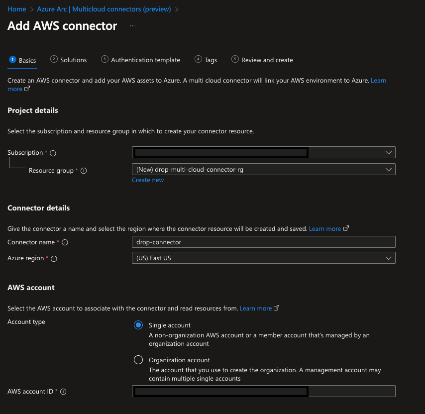

5. On the **Solutions** page, click the **Add** button for Inventory

You'll next need to specify the settings to the Inventory solution.  By default, all available AWS services and all AWS regions are selected. In addition, period sync is enabled by default with a one hour sync period.  Change these settings if desired.

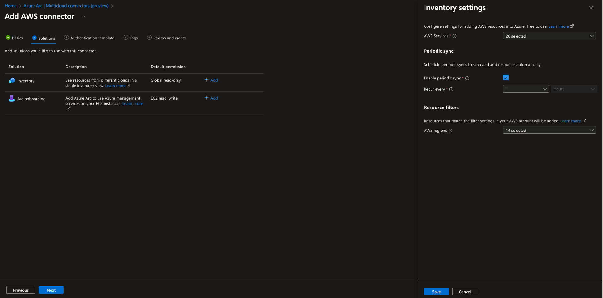

6. Click **save**

7. On the **Solutions** page, click the **Add** button for Arc onboarding

8. If needed, change the settings in the Arc onboarding settings screen (e.g. connectivity method, resource filters, etc.).

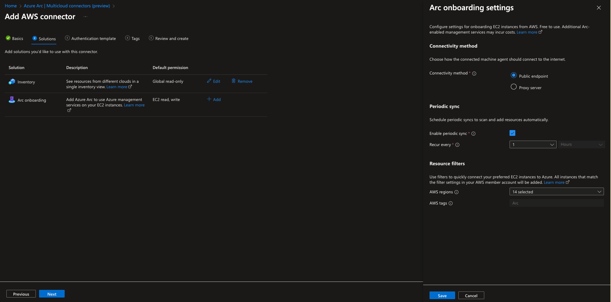

9. Click **save**

10. With both solutions added to the **Add AWS connector** screen, click **Next**

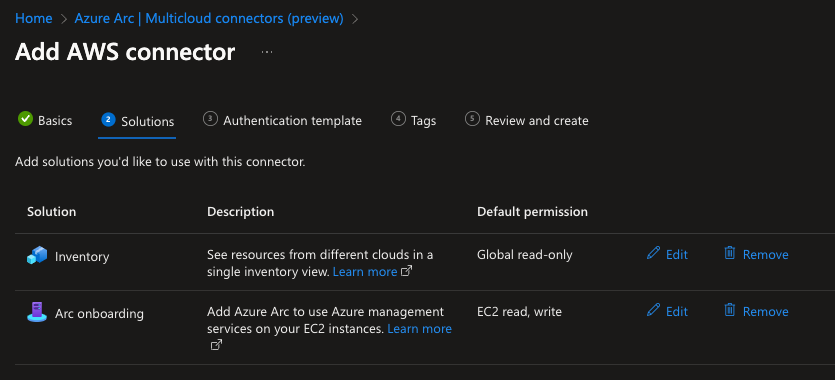

11. Download the AWS CloudFormation template generated in the Portal

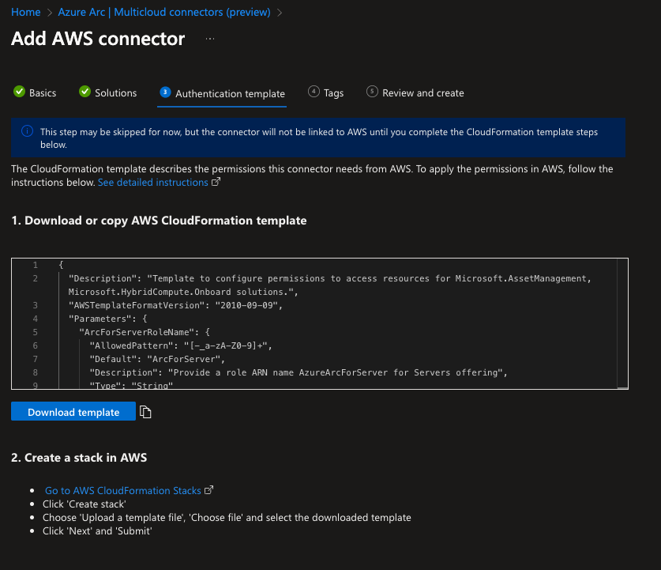

12. Click **Next**

13. Add any tags, if desired

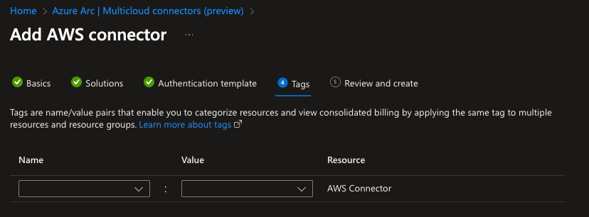

14. Click **Next**

15. On the Review and create screen, verify that the settings you specify are correct and click **Create**

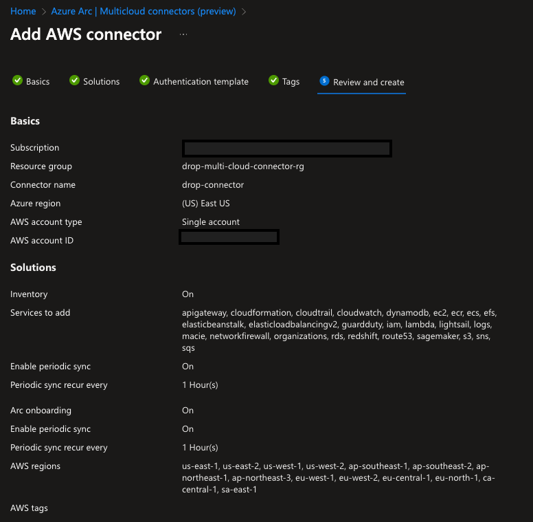

16. Click **Create**

At this point, the Multicloud connector resource is created in Azure but now you need to upload the generated CloudFormation template in AWS.

### Upload CloudFormation template to AWS

In this section, you'll complete these steps in AWS.

> the steps below assume you're deploying this to a single account in AWS.  If deploying to an organizational account, you'll need to follow the [documentation](https://learn.microsoft.com/en-us/azure/azure-arc/multicloud-connector/connect-to-aws#create-stackset) to create a StackSet after completing the steps below.

1. In the AWS console, navigate to the CloudFormation service and click on Create stack


2. In the specify a template section, click **Upload a template file** and upload the JSON file you downloaded in Step 11 of the previous section

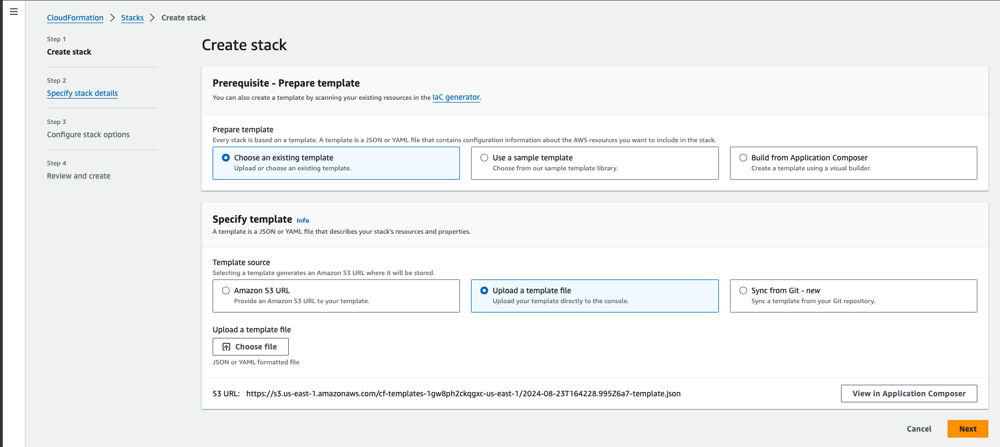

3. Provide a name for the stack and leave the other parameters as-is

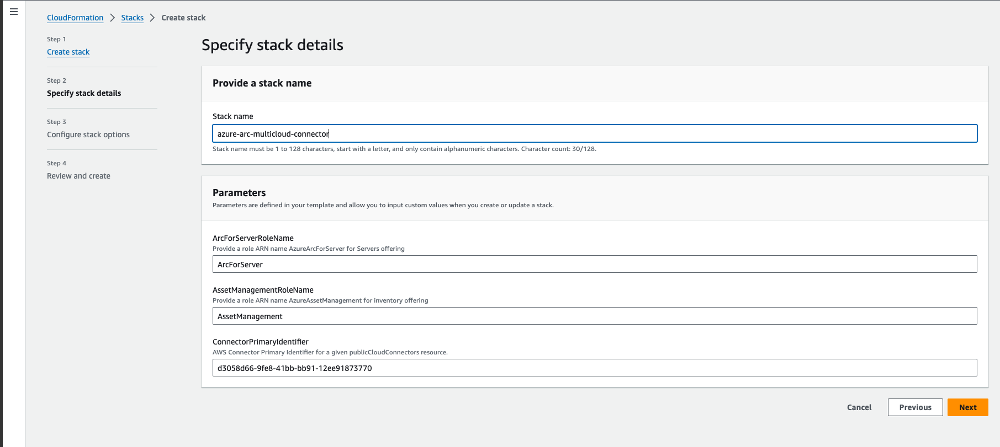

4. Leave the options on the **Configure stack options** screen as-is and select **Next**

5. On the **Review and create** page, review the information on the screen and select the acknowledgement checkbox and click **Submit**


> If using an organization account, you'll also need to create a StackSet as described [here](https://learn.microsoft.com/en-us/azure/azure-arc/multicloud-connector/connect-to-aws#create-stackset)

After the CloudFormation template is deployed, it takes approximately one hour for AWS resources to appear in Azure.

## Onboarding EC2 Instances to Azure Arc

In order for EC2 instances to be onboarded to Azure Arc, the EC2 instances must have a tag with a key of **arc** (with any value) and have the ArcForServerSSMRole IAM role assigned.

In the screenshot below, the tag of **arc** is sufficient to have this instance onboarded to Azure Arc.


In addition, the next screenshot shows the ArcForServerSSMRole successfully attached to this instance.  Refer to [this](https://docs.aws.amazon.com/AWSEC2/latest/UserGuide/iam-roles-for-amazon-ec2.html#attach-iam-role) documentation for attaching this role to the EC2 instance(s). 

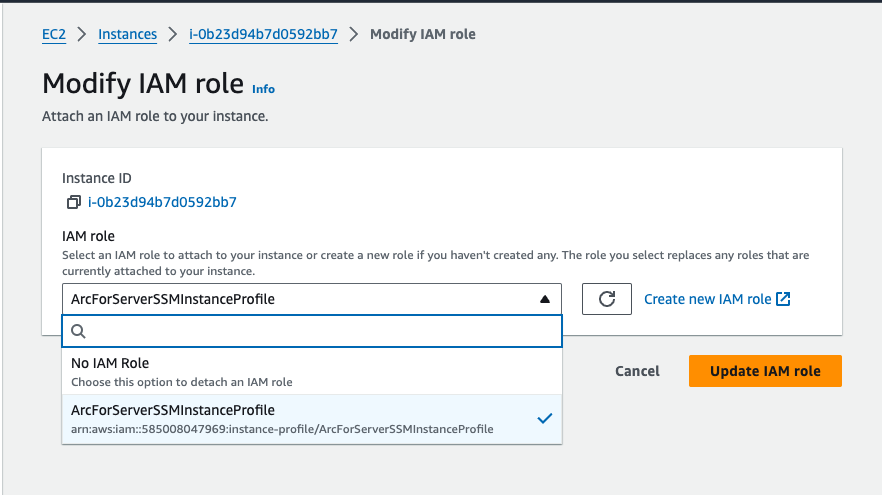

After the next hourly sync, your EC2 instances should appear connected within the Azure portal.  Because these instances were tagged in AWS with the **arc** key and have the ArcForServerSSMRole attached, they are automatically onboarded to Azure Arc.


After onboarding, consider using additional Azure features like deploying the [Azure Monitor Agent](https://azurejumpstart.azure.com/deploy_the_azure_monitor_agent_to_an_azure_arc-enabled_server) to monitor EC2 instances from Azure.

## AWS Inventory in Azure

In addition to onboarding EC2 instances to Azure Arc, the multicloud connector also shows an inventory of other AWS resources in Azure.  These resources are created in a resource group that follows the naming convension of **aws_yourAwsAccountId**.

Because AWS resources are now represented in Azure, Azure Resource Graph queries can be used to find resources across clouds.  To see how this works, do the following:

1. In the Azure portal, go to Azure Resource Graph Explorer.

2. In the query field, paste the query below to identify Azure Virtual Machines and AWS EC2 instances:

```shell
resources 
| where (['type'] == "microsoft.compute/virtualmachines") 
| union (awsresources | where type == "microsoft.awsconnector/ec2instances")
| extend cloud=iff(type contains "ec2", "AWS", "Azure")
| extend awsTags=iff(type contains "microsoft.awsconnector", properties.awsTags, ""), azureTags=tags
| extend size=iff(type contains "microsoft.compute", properties.hardwareProfile.vmSize, properties.awsProperties.instanceType.value)
| project subscriptionId, cloud, resourceGroup, id, size, azureTags, awsTags, properties
```


In the above screenshot, note that the first two results are EC2 instances, whereas the third result is an Azure VM.  While this is a small example, imagine having thousands of VMs spread across Azure and another cloud.  Because the multicloud connector is pulling in resources from another cloud, it's easy to see your full IT estate.

Working across clouds, you may want to find all resources containing a particular tag regardless of which cloud the resource is in.  An Azure Resource Graph query can be used to identify these resources.  For example, consider an example where AWS and Azure resources are tagged with **demo**.  The query below identifies these tagged resources across clouds:

```shell
resources 
| extend awsTags=iff(type contains "microsoft.awsconnector", properties.awsTags, ""), azureTags=tags 
| where awsTags contains "demo" or azureTags contains "demo" 
| project subscriptionId, resourceGroup, name, azureTags, awsTags
```

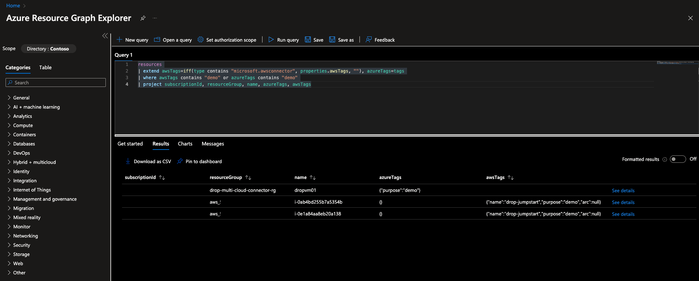

## Resources

For help deploying the multicloud connector, refer to [Connect to AWS with the multicloud connector in the Azure portal](https://learn.microsoft.com/en-us/azure/azure-arc/multicloud-connector/connect-to-aws).

[Onboard VMs to Azure Arc through the multicloud connector](https://learn.microsoft.com/en-us/azure/azure-arc/multicloud-connector/onboard-multicloud-vms-arc) describes the specific steps to onboard EC2 instances to Azure.

Finally, [View multicloud inventory with the multicloud connector enabled by Azure Arc](https://learn.microsoft.com/en-us/azure/azure-arc/multicloud-connector/view-multicloud-inventory) describes how metadata from multicloud resources are synchronized and represented in Azure.