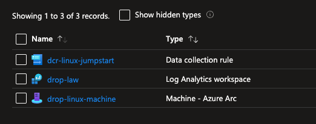
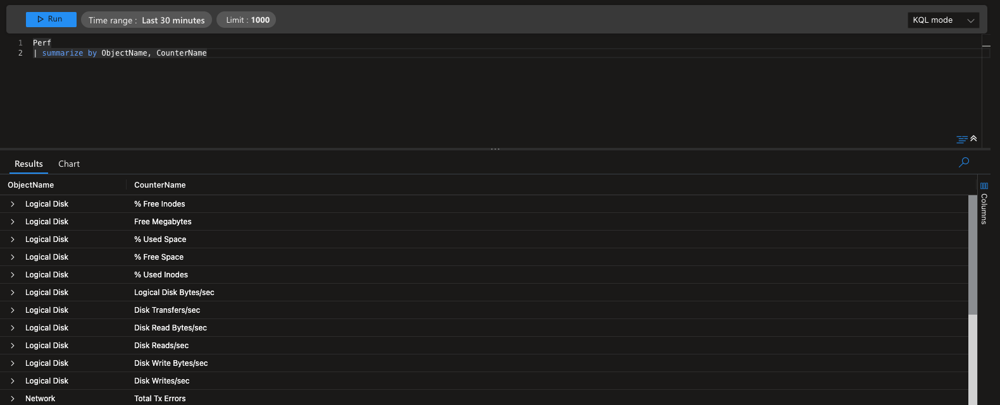
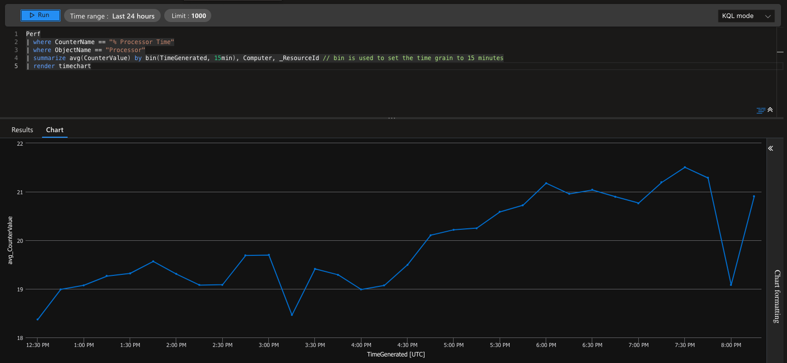
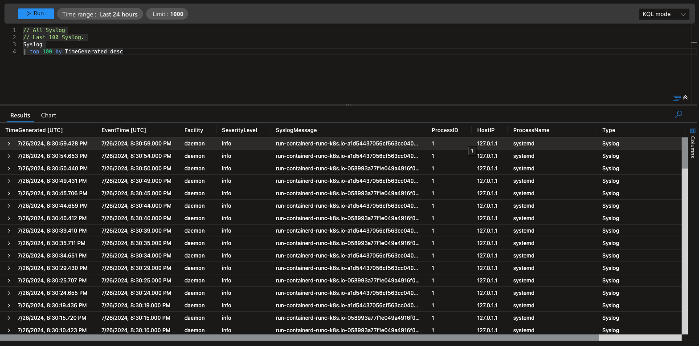

## Overview

This Drop will you guide you through using the Azure Monitor Agent on an existing Linux Arc-enabled server.

## Prerequisites

- this Drop starts at the point where you have already deployed and connected one or more machines to Azure Arc.  If you need an Azure Arc-enabled server, search for other Drops or use a Jumpstart scenario like [Deploy a local Ubuntu server hosted with Vagrant and connect it Azure Arc](https://azurearcjumpstart.io/azure_arc_jumpstart/azure_arc_servers/vagrant/local_vagrant_ubuntu/)

- [Install or update Azure CLI to the latest version](https://learn.microsoft.com/cli/azure/install-azure-cli?view=azure-cli-latest).

- an existing resource group in Azure


## Getting Started

### Deployment

Set the name of your resource group and Arc-enabled server:

```bash
RESOURCE_GROUP=drop-monitoring-rg
ARC_MACHINE_NAME=drop-linux-machine
WORKSPACE_NAME=drop-law
```

Using an Azure Resource Manager (ARM) template, you'll deploy the following resources:
- a Log Analytics Workspace
- a data collection rule
- a data collection rule association
- the Azure Monitor Agent extension for your existing Arc-enabled server

To deploy, run `az deployment group create -g $RESOURCE_GROUP --name drop-monitoring-deployment --template-file ama-linux-template.json --parameters workspaceName=$WORKSPACE_NAME --parameters vmName=$ARC_MACHINE_NAME` 

After the deployment completes, verify that the data collection rule and Log Analytics Workspace were created.



Next, verify that the Azure Monitor Agent is installed as an Extension.  Note that it may show its status as "Creating" initially while the extension is deployed.


### Viewing Metrics and Logs

It will take several minutes for the AzureMonitorLinuxAgent extension to be installed (if not already installed previously), followed by another few minutes for performance metrics and syslog data to begin to be populated.  Afterwards, naviate to the Logs section of your Arc-enabled server.

Run the following Kusto Query Language (KQL) query to see the types of data being collected:

```
Perf
| summarize by ObjectName, CounterName
```



This should match the performance counters that are specified in the ARM template.

Now let's chart a specific metric, percent processor time, by running:

```
Perf
| where CounterName == "% Processor Time"
| where ObjectName == "Processor"
| summarize avg(CounterValue) by bin(TimeGenerated, 15min), Computer, _ResourceId // bin is used to set the time grain to 15 minutes
| render timechart
```




In addition to these performance counters, the data collection rule also collects from Syslog.  Run the following query to see the last 100 Syslog records:

```
// All Syslog 
// Last 100 Syslog. 
Syslog 
| top 100 by TimeGenerated desc
```




The actual content of these queries will differ based on the activity occuring on your Arc-enabled server.  From here, you can run additional KQL queries or create alert rules based on the data being collected.

## Resources

For more information on KQL, such as to build your own queries, refer to [Get started with log queries in Azure Monitor](https://learn.microsoft.com/en-us/azure/azure-monitor/logs/get-started-queries).

To learn more about data collection rules, refer to [Data Collection rules in Azure Monitor](https://learn.microsoft.com/en-us/azure/azure-monitor/essentials/data-collection-rule-overview).

Finally, to learn more about the Azure Monitor Agent, refer to [Azure Monitor Agent overview](https://learn.microsoft.com/en-us/azure/azure-monitor/agents/azure-monitor-agent-overview)