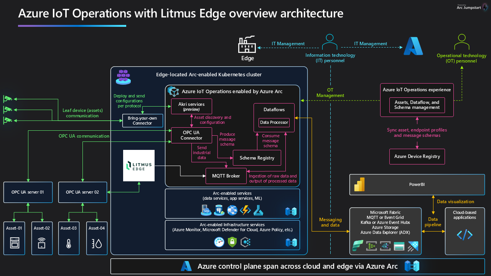
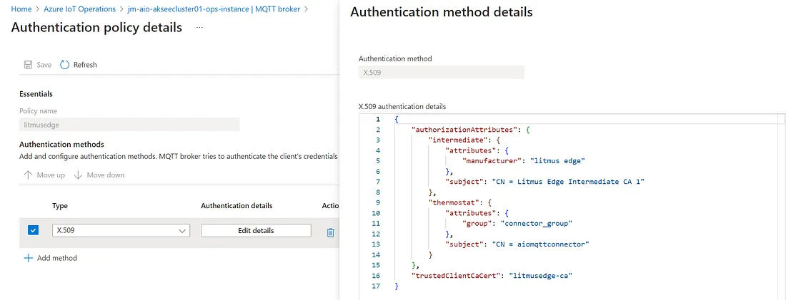
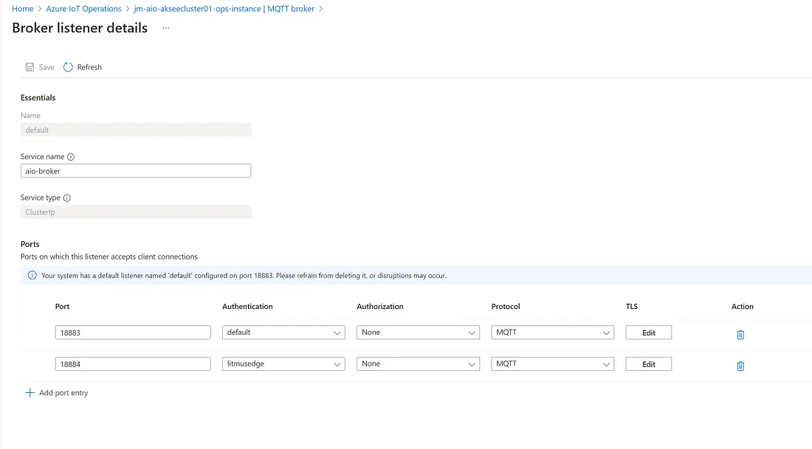
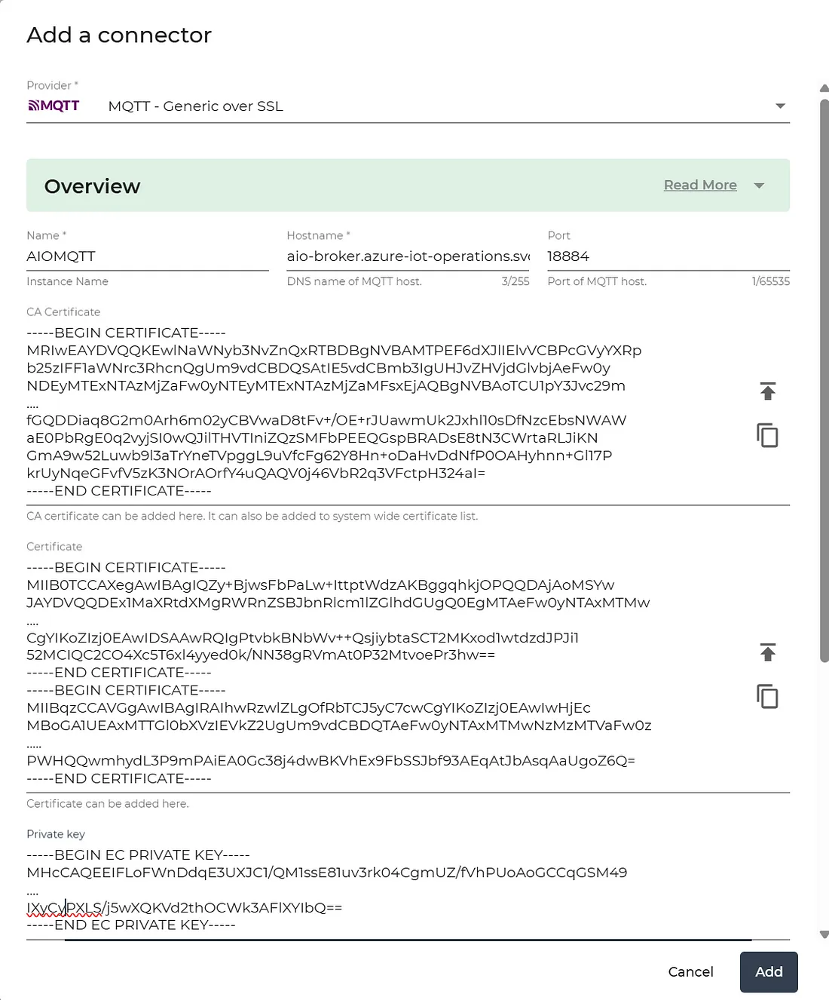
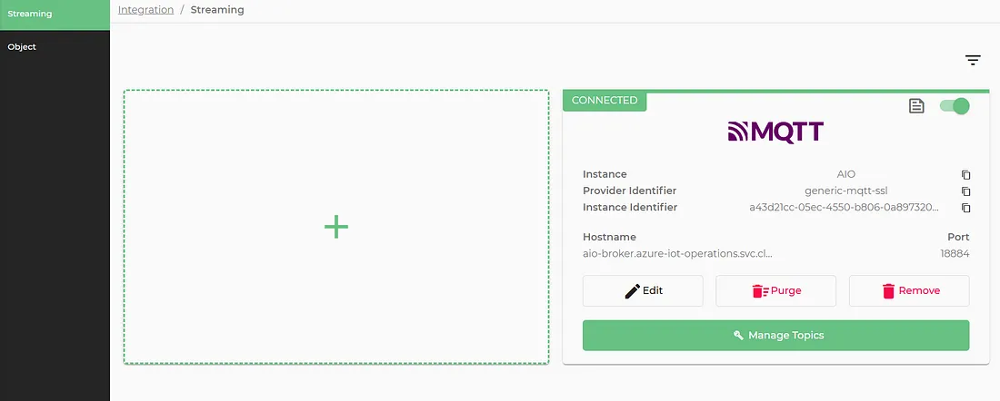
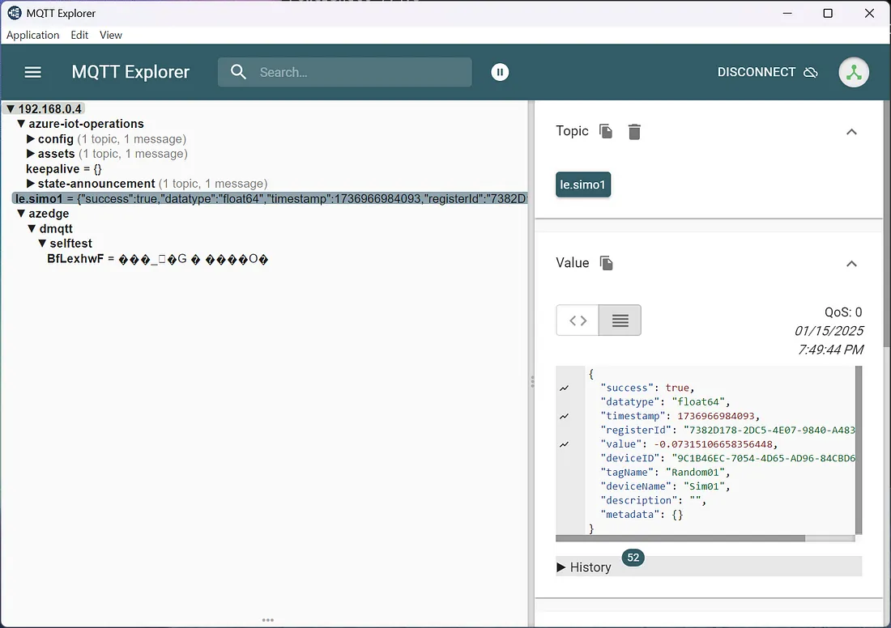

## Overview

The following Jumpstart Drop will guide you through integrating [Litmus Edge](https://litmus.io/litmus-edge) with Azure IoT Operations, by sending
Litmus Edge generated data to Azure IoT Operations MQTT broker for further processing.

## Architecture



Basically Azure IoT Operations runs on Azure Arc enabled Kubernetes clusters. Beside several other options, Litmus Edge offers a container deployment option, too, but is not providing ‘real’ Kubernetes support. It makes a lot of sense to run Litmus Edge as pod in the Azure IoT Operations Kubernetes cluster.

## Prerequisites

Note that to complete this Drop, you will need a complete [Azure IoT Operations installation](https://learn.microsoft.com/azure/iot-operations/deploy-iot-ops/overview-deploy). Additionally you will need access to the Litmus portal to get the Litmus Edge container image and access credentials as described below.  

## Getting Started

You'll first deploy Litmus Edge to the Azure Arc enabled Kubernetes cluster and in a second step connect it to the MQTT broker of Azure IoT Operations.

### Step 1 - Deploy Litmus Edge to Kubernetes

As already mentioned Litmus Edge doesn’t come with full Kubernetes support. Litmus is providing some installation documentation on their [website](https://docs.litmus.io/litmusedge/quickstart-guide/installation-and-deployments/kubernetes-installation), but needs some additional guidance to use it in production environments.

The Litmus Edge container image is not available in a public repository. It’s stored in the Litmus private repository and therefore needs some setup in the Kubernetes cluster first. To be able to access the Litmus Edge image in the private repository of Litmus, contact your Litmus account representative to get access to the service account .json file (typically called ‘litmus-se-read-json’). This file contains the necessary credentials.

Unfortunately up to now Litmus only provides a container image for Litmus Edge that is tagged with ‘latest’ instead of using the real version for the tag. That’s quite inconvenient, because any restart of the container could trigger an unwanted update. Therefore it’s highly recommended to use an own private container image registry, e.g. Azure Container registry, and tag the Litmus Edge image manually.

You can either pull down the image to your local Docker repository and push it to your private container registry or use the following Azure command line (shown for version 3.16.2 of Litmus Edge as currently available at the time of writing this):

```console
$litmusRepoPassword = Get-Content ./litmus-se-read.json

az acr import --name <name of your Azure container registry> --source us-docker.pkg.dev/litmus-sales-enablement/litmusedge/litmusedge-std-docker:latest `
 --image litmusedge/litmusedge-std-docker:3.16.2 --username _json_key --password $litmusRepoPassword
```

Next you have to create a namespace and a secret for the used docker configuration. If you haven’t moved the Litmus Edge image to your own private repository, then you have to do:

```console
kubectl create namespace 'le-prod'
$litmusRepoPassword = Get-Content ./litmus-se-read.json
kubectl create secret docker-registry litmus-credential --docker-server=us-docker.pkg.dev --docker-username=_json_key --docker-password=$litmusRepoPassword
```

If you are using your own private repository, replace the ‘kubectl create secret…’ line accordingly. For further guidance, see [Azure documentation](https://learn.microsoft.com/azure/container-registry/container-registry-auth-kubernetes).

Since we have the Litmus Edge image ready to be deployed to the Kubernetes cluster, we can now start the deployment. Litmus Automation is providing yaml configurations for the deployment on their website. Unfortunately they don’t provide a Helm chart and therefore I’ve created a sample implementation for the Helm deployment. It’s available on [GitHub](https://github.com/JMayrbaeurl/helmchart-repo/blob/main/litmusedge.MD) and used in the following description.

To use the Helm chart, start by doing (Replace ‘jmayrbaeurl’ with your preference for the Helm repo name):

```console
helm repo add jmayrbaeurl https://raw.githubusercontent.com/jmayrbaeurl/helmchart-repo/master/index
helm repo update jmayrbaeurl
```

If you are happy with the default values for the Helm chart parameters, then you can immediately start the deployment with:

```console
helm upgrade --install litmusedge jmayrbaeurl/litmusedge -n le-prod --create-namespace 
```

By default the Helm chart only deploys a service that’s reachable internally. If you want to access the Litmus Edge portal, you will have to either use ‘kubectl port-forward’ or add an additional service of type NodePort or LoadBalancer for port 443 of Litmus Edge. Or rerun the Helm deployment with the following comand (will expose Litmus portal on the load balancer):

```console
helm upgrade --install litmusedge jmayrbaeurl/litmusedge -n le-prod --create-namespace --set service.externalAccess=true
```

The Litmus Edge portal should now be accessible at https://1ocalhost.

Attention: The helm chart creates a persistent volume claim for the default storage class, that’s used to store all data. This persistent volume claim won’t be deleted by deleting the Helm release.

### Step 2 - Connect Litmus Edge to Azure IoT Operations

Now that Litmus Edge is running as a pod on the Azure IoT Operation Kubernetes cluster, it’s also interesting to stream the data from Litmus Edge to Azure IoT Operations for further processing. Litmus Edge provides a connector called ‘[MQTT — Generic over SSL](https://docs.litmus.io/litmusedge/product-features/integration/integration-connectors/message-brokers/mqtt-generic-over-ssl)’ that can be used to securily connect Litmus Edge to a generic MQTT broker, like the one from Azure IoT Operations.

Azure IoT Operation’s MQTT broker comes with several listener, that can be used to connect other services to it. We will use the so called internal [default listener](https://learn.microsoft.com/azure/iot-operations/manage-mqtt-broker/howto-configure-brokerlistener?tabs=portal%2Ctest#default-brokerlistener) of the MQTT broker, that out-of-the-box only supports Kubernetes service account authentication, but has full TLS support. We are not really changing the default listener, because that’s not recommended and needed to work correctly for internal purposes of Azure IoT Operations. We’ll just add another authentication policy for X509 certificates, since Litmus Edge is not supporting Kubernetes service accounts for MQTT connections yet.

But first let’s start creating and collecting the required certificates. For TLS we will have to collect the ca certificate of the default listener of the Azure IoT Operations MQTT broker, that is stored in a secret on the Kubernetes cluster. Run the following command in Powershell. The certificate will be stored in a file called ca.cert in the current folder.

```console
kubectl get configmap azure-iot-operations-aio-ca-trust-bundle -n azure-iot-operations -o "jsonpath={.data['ca\.crt']}" > ca.cert
```

For Litmus Edge, used as client for the Azure IoT Operations MQTT broker, we have to create client-side X509 certificates for authentication. This can be done with the step cli by the following commands:

```console
# Create root certificate
step certificate create "Litmus Edge Root CA" litmusedge_root_ca.crt litmusedge_root_ca.key --profile root-ca --no-password --insecure

# Create intermediate certificate
step certificate create "Litmus Edge Intermediate CA 1" litmusedge_intermediate_ca.crt litmusedge_intermediate_ca.key `
--profile intermediate-ca --ca .\litmusedge_root_ca.crt --ca-key .\litmusedge_root_ca.key --no-password --insecure

# Create a client certificate for the aiomqttconnector
step certificate create aiomqttconnector aiomqttconnector.crt aiomqttconnector.key `
--ca .\litmusedge_intermediate_ca.crt --ca-key .\litmusedge_intermediate_ca.key --bundle `
--not-after 2400h --no-password --insecure

# Litmus Edge root ca for MQTT broker trust
kubectl create configmap litmusedge-ca -n azure-iot-operations --from-file=client_ca.pem=litmusedge_root_ca.crt
```

With this certificates we can now add the already mentioned authentication policy with the name ‘litmusedge’ for the default listener (see [tutorial](https://learn.microsoft.com/azure/iot-operations/manage-mqtt-broker/tutorial-tls-x509#configure-mqtt-broker)).



Use the following json for the X.509 authentication details and 18884 for the port.

```console
{
    "authorizationAttributes": {
        "intermediate": {
            "attributes": {
                "manufacturer": "litmus edge"
            },
            "subject": "CN = Litmus Edge Intermediate CA 1"
        },
        "thermostat": {
            "attributes": {
                "group": "connector_group"
            },
            "subject": "CN = aiomqttconnector"
        }
    },
    "trustedClientCaCert": "litmusedge-ca"
}
```

The default listener now looks like



The default listener is now ready for internal TLS connections on port 18884 for a client that is using a X.509 certificate with the common name ‘aiomqttconnector’ in its subject.

Next a connector for the MQTT broker of Azure IoT Operations in Litmus Edge has to be configured. Open the Litmus Edge portal and go to the tab ‘Integration/Streaming’ and click on the plus sign to create a new connector of type ‘MQTT over SSL’.



No ClientID, username and password has to be entered. Simply leave them empty. Click ‘Add’ and when returning to the portal the connector should be ‘green’ showing a working connection:



Finally you have to add topics by clicking ‘Manage Topics’ for already configured devices in Litmus Edge.


Afterwards the working setup can be verified by inspecting the MQTT topics of Azure IoT Operations with a tool like MQTT Explorer:



### Conclusion
Litmus Edge is a very good solution for doiny any kind of data transformation and contextualization at the edge. It can be run as a container in a pod on a Kubernetes cluster (as it is the case with Azure IoT Operations). It is a perfect extension to the Edge processing capabilities of Azure IoT Operations.

Unfortunately it wasn’t designed as a ‘cloud native’ solution and therefore misses several capabilities to run it optimally in production environments (see several samples in this article). It can probably only be scaled vertically, but horizontal scaling, as preferred in Kubernetes clusters with multiple replicas of the same pod, is not working correctly, because this would need the distribution of tasks to all available pods.

Another issue is the monolithic approach of the solution. The frontend of the Litmus Edge portal, the data transformation engine and the device connectors are all running in the same container and therefore can’t be horizontally scaled independently.

Last but not least it is important to mention, especially in the context of the shown connectivity to the Azure IoT Operation MQTT broker, that there’s currently no way to participate in the automatically managed X.509 certificates of the Kubernetes cluster. E.g., the generated server-side certificate, used for the TLS connectivity between Litmus Edge and the Azure IoT Operations MQTT broker, will expire one year after the installation of Azure IoT Operations. It will be automatically renewed, but this change or the new certificate can’t be automatically propagated to Litmus Edge. So you’ll have to monitor all used certificates and apply the necessary changes to the Litmus Edge configuration manually and in time.

Anyway. Running Litmus Edge with Azure IoT Operations on a Kubernetes cluster is definitely one of the best available options.
